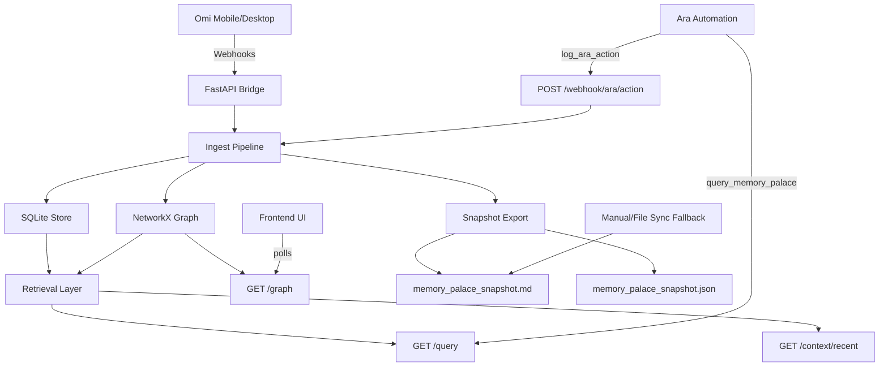

# Memory Palace

Memory Palace connects Omi conversation context and Ara actions into one shared memory graph.

It gives you:
- Omi webhook ingestion for conversations, memories, transcripts, and day summaries
- a SQLite + NetworkX graph store
- retrieval endpoints for personalized context packs
- an Ara automation that reads from the graph and logs actions back into it
- a frontend graph viewer
- Markdown/JSON snapshot exports for fallback file-based syncing into Ara

## Architecture



## Repo Map

- [server.py](C:/Users/chels/OneDrive/Documents/GitHub/portfolio/Ara-hack/server.py:1): FastAPI server and webhook endpoints
- [app.py](C:/Users/chels/OneDrive/Documents/GitHub/portfolio/Ara-hack/app.py:1): Ara automation entrypoint
- [ingest.py](C:/Users/chels/OneDrive/Documents/GitHub/portfolio/Ara-hack/ingest.py:1): Omi/Ara ingestion pipeline
- [graph.py](C:/Users/chels/OneDrive/Documents/GitHub/portfolio/Ara-hack/graph.py:1): graph storage/query layer
- [db.py](C:/Users/chels/OneDrive/Documents/GitHub/portfolio/Ara-hack/db.py:1): SQLite helpers
- [retrieval.py](C:/Users/chels/OneDrive/Documents/GitHub/portfolio/Ara-hack/retrieval.py:1): context-pack ranking and formatting
- [adapters/omi.py](C:/Users/chels/OneDrive/Documents/GitHub/portfolio/Ara-hack/adapters/omi.py:1): Omi payload normalization
- [snapshot.py](C:/Users/chels/OneDrive/Documents/GitHub/portfolio/Ara-hack/snapshot.py:1): Markdown/JSON snapshot export
- [frontend/src/App.jsx](C:/Users/chels/OneDrive/Documents/GitHub/portfolio/Ara-hack/frontend/src/App.jsx:1): graph UI

## Requirements

- Python 3.11+
- Node 18+
- Omi app with Developer Settings enabled
- Ara CLI and account
- `ngrok` or another public tunnel if testing local webhooks

## Backend Setup

From the repo root:

```cmd
python -m venv .venv
.venv\Scripts\activate.bat
python -m pip install -U pip
python -m pip install fastapi uvicorn pydantic networkx httpx ara-sdk
python -m pip install sentence-transformers
```

Notes:
- `sentence-transformers` is optional but recommended
- if embeddings cannot load, the app falls back to hashed embeddings

## Frontend Setup

From [frontend](C:/Users/chels/OneDrive/Documents/GitHub/portfolio/Ara-hack/frontend:1):

```cmd
npm install
npm run dev
```

If Vite fails with missing `react` or `react-dom`, do a clean reinstall:

```cmd
rmdir /s /q node_modules
del package-lock.json
npm install
```

## Environment Variables

Set these in the terminal where you run the backend/Ara commands:

```cmd
set MEMORY_PALACE_API_TOKEN=dev-token
set MEMORY_PALACE_API_BASE=http://127.0.0.1:8000
set OMI_API_KEY=your_omi_dev_key
```

For Ara cloud/runtime access, `MEMORY_PALACE_API_BASE` must be public, for example:

```cmd
set MEMORY_PALACE_API_BASE=https://your-ngrok-url.ngrok-free.app
```

## Run Order

### 1. Start the backend

```cmd
python -m uvicorn server:app --reload
```

### 2. Start a public tunnel

Example with ngrok:

```cmd
ngrok http 8000
```

### 3. Start the frontend

```cmd
cd frontend
npm install
npm run dev
```

### 4. Deploy/run the Ara automation

From the repo root:

```cmd
ara auth login
ara deploy app.py
ara run app.py
```

## Omi Webhook URLs

Once you have a public URL, configure Omi Developer Settings with:

- `Conversation Events` -> `https://YOUR-URL/webhook/omi/conversation`
- `Day Summary` -> `https://YOUR-URL/webhook/omi/day-summary`
- optional `Real-time Transcript` -> `https://YOUR-URL/webhook/omi/transcript`

Useful sanity checks:

```cmd
curl http://127.0.0.1:8000/webhook/omi/conversation
curl http://127.0.0.1:8000/webhook/omi/day-summary
curl http://127.0.0.1:8000/health
```

## Main Endpoints

- `POST /webhook/omi/memory`
- `POST /webhook/omi/conversation`
- `POST /webhook/omi/day-summary`
- `POST /webhook/omi/transcript`
- `POST /webhook/ara/action`
- `GET /query?q=...`
- `GET /context/recent`
- `GET /graph`
- `GET /export/memory-palace.md`
- `GET /export/memory-palace.json`
- `GET /health`

## Quick Test

### Health

```cmd
curl http://127.0.0.1:8000/health
```

### Insert a sample Omi memory

```cmd
curl -X POST http://127.0.0.1:8000/webhook/omi/memory ^
  -H "Content-Type: application/json" ^
  -d "{\"id\":\"mem-1\",\"summary\":\"Working on Omi to Ara integration\",\"people\":[\"Alice\"],\"action_items\":[\"Test query endpoint\"]}"
```

### Query the graph

```cmd
curl "http://127.0.0.1:8000/query?q=What%20was%20I%20working%20on%3F"
```

### Run the smoke test

```cmd
python -B test_graph.py
```

## Snapshot Export

After any successful Omi/Ara write, the backend regenerates:

- [exports/memory_palace_snapshot.md](C:/Users/chels/OneDrive/Documents/GitHub/portfolio/Ara-hack/exports/memory_palace_snapshot.md)
- [exports/memory_palace_snapshot.json](C:/Users/chels/OneDrive/Documents/GitHub/portfolio/Ara-hack/exports/memory_palace_snapshot.json)

This is the current fallback for getting Memory Palace context into generic Ara chat:

1. export the latest snapshot
2. upload or paste `memory_palace_snapshot.md` into Ara's `memory/` folder
3. ask Ara to use that file as personal context

## Demo Flow

1. Omi sends a conversation webhook to the backend
2. the backend writes graph nodes/edges and regenerates snapshot files
3. the frontend updates through `/graph`
4. Ara queries `/query` through `query_memory_palace`
5. Ara answers with graph-backed context
6. Ara action logging writes new Ara nodes back to the graph

## Current Notes

- The graph backend and Omi webhook ingestion are working
- Ara automation deployment is working
- Generic Ara chat does not automatically use the deployed automation's tools
- The file-snapshot fallback is currently the most reliable way to give generic Ara chat Memory Palace context
- The frontend depends on a complete `npm install`

## Troubleshooting

### Omi webhook returns 500

Watch the backend logs. The server prints:

```text
webhook_received endpoint=...
```

and now logs a traceback on failing conversation/day-summary payloads.

### Frontend says it cannot resolve `react-dom/client`

Your `frontend/node_modules` is incomplete. Re-run:

```cmd
cd frontend
npm install
```

### Ara cannot reach the backend

Ara cloud cannot use `http://127.0.0.1:8000`. Use your public tunnel URL in:

```cmd
set MEMORY_PALACE_API_BASE=https://YOUR-URL.ngrok-free.app
```

### `ara run app.py` gives a generic response

That command triggers the automation, but it does not automatically simulate a rich user chat flow. For the demo, use the deployed automation plus backend retrieval, or rely on the snapshot-file fallback inside Ara chat.
